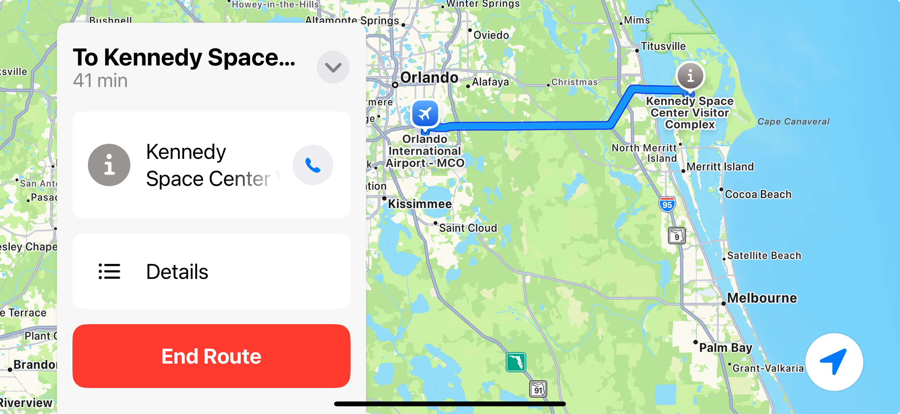

How this class works
====================

In this section we will talk about the final project for the class, why it's important, and
some of the things that you will learn as you implement it. This project is designed with
a number of goals in mind:

* To demonstate a real-world and current problem being solved every day by software
  running in cars, on phones, or on computers.
* To learn about programming in a modern computer language, in this case, the Python language
  that is used by software engineers every day
* To learn modern programming techniques that will make you better at solving not just
  programming problems that you might have in the future, but complex problems in general
  where the use of these principles will help you develop your own solutions.

GPS Navigation
--------------

People use mapping programs based on Global Positioning System (GPS) satellites every day to help them
drive from one place to another. They have been built into cars and are now available on portable
devices like cell phones and handheld navigators. They attempt to present the most optimal route
to get from one place to another.

But what is the most optimal route? Think about some of the things that might make one route better
than another.

* Shortest distance to maximize fuel used
* Least travel time to get somewhere in a hurry
* Minimizing the elevation gains for hikers
* Minimizing the highway tolls that have to be paid
* Including stops for recharging an electric car

What are some of the things that might go into the calculation of the most optimal route?

* Road conogestion on a particular part of the route
* Road construction that might slow down travel
* Highway roads that might be longer vs more direct but slower city streets
* Accidents on a road that slow traffic that might even occur once the trip begins

Our final project
-----------------
The final project that you will do is to find the shortest path between intersections
on a grid of squares. This is a simplified version of the problem just discussed, but
it has many of the same characteristics of the real case. To make it more realistic,
some of the intersections in the grid will be blocked, representing accidents or
road construction that your robot will have to avoid. 

The algorithm that we will use is very similar to what commercial GPS navigators use
to help us drive from one place to another. We will discuss it in more detail when we
get near the end of the course.

Top-down design
---------------
Even though the final project can be challenging, we will approach the problem the
same way you might do it if you were an engineer designing a navigation system. We
will break the problem down into simpler tasks until we get to ones we can
solve, then solve those, and keep moving towards the full solution. We'll talk more
about this top-down design concept in a future lesson.

Reuse of code
-------------
Another way of simplifying the implementation of a complex program is to reuse as
much code as possible. That means that as we write and test the pieces of the
project in our top-down design, we will try to write those smaller programs so
that they can be reused with little to no changes to implement the final design.
That way, once we write some code, say, line following, once we know it works
we can keep reusing it without having to write it again for other parts of the
program.

To have the best chance of a high level of code reuse, we will implement the
pieces of the program using an Object Oriented design. We'll talk more about
what this means later, but it is a way of building up the larger program from
the smaller, and easier-to-write and easier-to-test smaller components.

