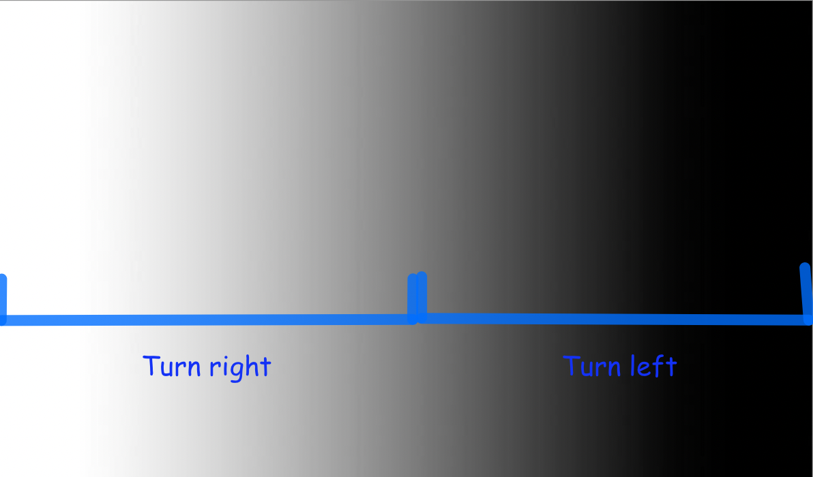

Following Lines: On-Off
=======================

Now, let's turn our attention towards one of the core challenges in the final
project - following a line. In the project, the robot will need to drive to
multiple different locations, but doing this just based on distance can result
in the robot not getting to exactly the right place. What if the wheels slip
while driving? What if the robot needs to drive along a complex curve? It's
easier to follow a line than it is to exactly measure out the course the robot
needs to follow and program it.

How do we follow a line?
------------------------

Consider using two reflectance sensors. As a refresher, they give a reading
from 0 (black) to 1 (white). Assuming that the reflectance sensors are
placed on the left and right sides of the robot, they will at least partially
read the black line when the robot is centered on the line. What type of logic
would we need if we wanted to follow the center of the line?

Well, if both reflectance sensors read black, it means the robot is perfectly on
the line, and we'd want to go straight, setting the motors at the same speed.
But if one of the reflectance sensors reads grey or white, it would mean that
the robot is partially or completely off the line. We'd want to correct this by
steering it back to the center.

If the left sensor reads closer to white, that means we're too far to the left,
so we need to turn slightly to the right. If the right sensor reads closer to
white, that means we're too far to the right, so we need to turn slightly to the
left.

And that's it! We want to keep polling (getting the value of) the reflectance
sensors quickly, and at each time determine whether they are closer to white
(with a value less than 0.5) or closer to black (with a value greater than 0.5),
and depending on the result, either set the motor to turn right (set left motor
speed to be faster than right) or turn left (set right motor speed to be faster
than left).

This seems like a solution involving an if-else statement. Our condition would
be related to whether the values are greater or less than 0.5.

As a quick reminder, an :code:`if` / :code:`else` statement allows you to run different blocks of
code based on a *condition* (the same kind of *condition* you used in a
:code:`while` loop)

Consider the following example code:

.. code-block:: python

    from XRPLib.defaults import *

    class LineTracker:
        def __init__(self):
            """Initializes the line tracker by setting up the reflectance sensors."""
            self.left_sensor = reflectance.get_left
            self.right_sensor = reflectance.get_right

        def is_over_line(self, threshold):
            """Checks if both sensors detect the line based on the given threshold."""
            return self.left_sensor() > threshold and self.right_sensor() > threshold

        def on_off_signal(self):
            """Generates control signals based on sensor readings."""
            left_sensor = self.left_sensor()
            right_sensor = self.right_sensor()
            
            if left_sensor < 0.5 and right_sensor < 0.5:
                return 50, 50  # Go straight
            elif left_sensor >= 0.5:
                return 30, 50  # Turn right
            elif right_sensor >= 0.5:
                return 50, 30  # Turn left

    line_tracker = LineTracker()

    while True:
        left_speed, right_speed = line_tracker.on_off_signal()
        drivetrain.set_speed(left_speed, right_speed)

In this example code, we adjust the motor speeds based on the values of the
left and right reflectance sensors. You could put whatever code you want in the
blocks instead. For example, you could have the robot turn clockwise or
counterclockwise depending on a condition using an :code:`if` / :code:`else`
statement.

    Actions your robot should take based on what the sensors see.

Above is an illustration of how we'd want the robot to act based on the readings
of the sensors.

.. admonition:: Try it out

    Write some code which uses an :code:`if` / :code:`else` statement to turn 
    the robot one direction or another based on the reflectance sensors. To do 
    this, you'll use the :code:`drivetrain.set_speed` function using different
    speeds for the left and right wheels. Remember, using a higher speed on the
    left wheel will make the robot turn right, and vice versa. You can use your 
    ``is_over_line()`` function to check if the sensors see a line.

    You will need to experiment with different speed values for each wheel; too
    high and your robot will drive off the line before it gets a chance to
    correct for it, too low and your robot will not correct in time and will
    spin in circles. Try to get your robot to follow the line as fast as you
    can!
