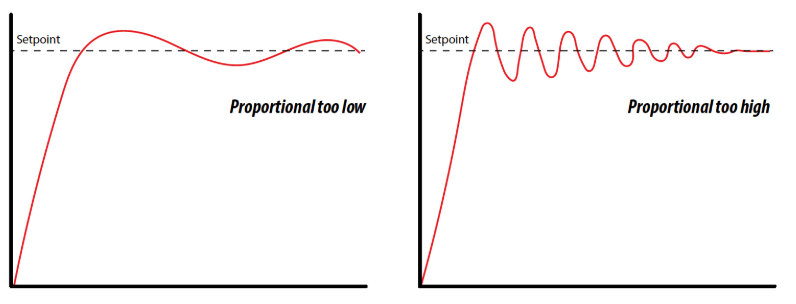

Following the Line: Proportional Control
========================================

**Daily Goals**

* Understand the concept of proportional control in robotics and how it differs from on-off control.
* Learn how to implement proportional control for line following by adjusting motor speeds based on the error between sensor readings.
* Understand the role of the proportional gain (KP) and how it affects the robot's line following behavior.
* Learn how to tune the KP value through experimentation to achieve smooth and stable line following.
* Implement a "racing around a circle" activity using proportional control and the line sensor to detect an intersection and turn around.

Introduction to Proportional Control
------------------------------------

In the previous lesson, we designed an *on-off* controller which had discrete actions depending on the error between the two sensors. However, this controller is not very smooth and can lead to oscillations. In this lesson, we will introduce a more advanced control technique called *proportional control* to make the robot follow the line more smoothly.

Line following with proportional control is a common technique used in robotics to keep a robot on a desired path. The idea behind proportional control is to make corrections relative to the amount of error. That is, if there is a large amount of error, the robot will try to correct quickly, and if there is a small amount of error, the robot will make small corrections to get to the desired position.

Instead of having discrete actions depending on the error, let's define a proportional signal that is proportional to the error between the two sensors. The proportional signal will be used to adjust the motor speeds based on the error. To do this, let's define a `proportional_signal` function in the `LineTracker` class which takes in a 'proportional gain' (KP) and follows the line based on the error between the sensors.

.. code-block:: python

    from XRPLib.defaults import *

    class LineTracker:
        def __init__(self, drivetrain):
            """Initializes the line tracker with a LineSensor object and a drivetrain object."""
            self.sensor = LineSensor()
            self.drivetrain = drivetrain

        def drive_until_line(self, threshold, speed):
            """Drives forward until the line sensors detect the robot is over the line."""
            self.drivetrain.set_speed(speed, speed)
            while not self.is_over_line(threshold):
                pass  # Keep driving until the line is detected
            self.drivetrain.stop()

        def line_follow_on_off(self, speed):
            """Adjusts the motor speeds based on the error between the left and right sensor readings (on-off control)."""
            error = self.sensor.get_error()
            if error > 0:
                self.drivetrain.set_speed(speed, speed - 0.1)
            elif error < 0:
                self.drivetrain.set_speed(speed - 0.1, speed)
            else:
                self.drivetrain.set_speed(speed, speed)

        def line_follow_proportional(self, KP, base_speed):
            """Follows the line using proportional control."""
            error = self.sensor.get_error()
            proportional_signal = KP * error
            left_speed = base_speed - proportional_signal
            right_speed = base_speed + proportional_signal
            self.drivetrain.set_speed(left_speed, right_speed)

Tuning Proportional Gain
------------------------
The value of KP is crucial for the stability of the line following behavior. If KP is too high, the robot will overcorrect, causing it to oscillate back and forth across the line. If KP is too low, the robot will not correct quickly enough, and it may drift off the line.

    The effect of different KP values on the robot's behavior.

Intuitively, you can think of KP as how aggressively the robot tries to correct its error. A higher KP means more aggressive corrections, which can lead to overshooting and oscillations. A lower KP means more gentle corrections, which can lead to slow response times and drifting.

To tune the KP value, start with a small value and gradually increase it until the robot follows the line smoothly without oscillating. You may need to experiment with different KP values to find the optimal one for your robot and track.

Try to set up some code to start line following using the proportional control signal. Here's an example code snippet to get you started:

.. code-block:: python

    from XRPLib.defaults import *

    class LineSensor:
        def __init__(self):
            """Initializes the line sensor by setting up the reflectance sensors."""
            self.left_sensor = reflectance.get_left
            self.right_sensor = reflectance.get_right

        def is_over_line(self, threshold):
            """Checks if either sensor is over the line."""
            left_over_line = self.left_sensor() > threshold
            right_over_line = self.right_sensor() > threshold
            return left_over_line and right_over_line

        def report_values(self):
            left = self.reflectance.get_left()
            right = self.reflectance.get_right()
            print(f'left: {left}, right: {right}')

        def get_error(self):
            """Calculates the error as the difference between the left and right sensor readings."""
            left = self.left_sensor()
            right = self.right_sensor()
            return left - right

    class LineTracker:
        def __init__(self, drivetrain):
            """Initializes the line tracker with a LineSensor object and a drivetrain object."""
            self.sensor = LineSensor()
            self.drivetrain = drivetrain

        def line_follow_on_off(self, speed):
            """Adjusts the motor speeds based on the error between the left and right sensor readings."""
            error = self.sensor.get_error()
            if error > 0:
                self.drivetrain.set_speed(speed, speed - 0.1)
            elif error < 0:
                self.drivetrain.set_speed(speed - 0.1, speed)
            else:
                self.drivetrain.set_speed(speed, speed)

        def proportional_signal(self, KP, base_speed):
            """Generates motor speeds using proportional control based on the error between the sensors."""
            error = self.sensor.get_error()
            proportional_signal = KP * error
            left_motor_effort = base_speed - proportional_signal
            right_motor_effort = base_speed + proportional_signal
            return left_motor_effort, right_motor_effort

    drivetrain = Drivetrain()  # Initialize the drivetrain
    line_tracker = LineTracker(drivetrain)
    KP = 0.1  # Start with a small KP value
    base_speed = 50  # Base speed for the robot

    while True:
        left_speed, right_speed = line_tracker.proportional_signal(KP, base_speed)
        drivetrain.set_speed(left_speed, right_speed)

Here's what that a well-tuned controller looks like:

.. figure:: images/proportional_line_following.gif
    :align: center

    XRP following a line with proportional control. The robot would not be able
    to follow a curved line this quickly using on-off control!

Activity: Racing Around a Circle
--------------------------------
Now that you have a good understanding of proportional control for line following, let's put it to the test with a fun activity! In this activity, you will race your robot around a circular track that has an intersection. When the robot hits the intersection, the line tracker's `is_over_line` function should trigger the robot to turn around and race back to where it started. The fastest "full lap" wins the competition!

Here's a step-by-step guide to set up the activity:

1. Set up a circular track with an intersection. You can use black tape on a white surface to create the track.
2. Program your robot to follow the line using the proportional control code provided earlier.
3. Use the `is_over_line` function to detect when the robot hits the intersection.
4. When the intersection is detected, have the robot turn around and race back to the starting point.
5. Time how long it takes for the robot to complete the full lap (from start to intersection and back to start).
6. The robot with the fastest time wins the competition!

Here's a sample code snippet to get you started:

.. code-block:: python

    from XRPLib.defaults import *
    import time  # We'll need this to add a delay

    class LineSensor:
        def __init__(self):
            """Initializes the line sensor by setting up the reflectance sensors."""
            self.left_sensor = reflectance.get_left
            self.right_sensor = reflectance.get_right

        def is_over_line(self, threshold):
            """Checks if either sensor is over the line."""
            left_over_line = self.left_sensor() > threshold
            right_over_line = self.right_sensor() > threshold
            return left_over_line and right_over_line

        def report_values(self):
            left = self.reflectance.get_left()
            right = self.reflectance.get_right()
            print(f'left: {left}, right: {right}')

        def get_error(self):
            """Calculates the error as the difference between the left and right sensor readings."""
            left = self.left_sensor()
            right = self.right_sensor()
            return left - right

    class LineTracker:
        def __init__(self, drivetrain):
            """Initializes the line tracker with a LineSensor object and a drivetrain object."""
            self.sensor = LineSensor()
            self.drivetrain = drivetrain

        def line_follow_on_off(self, speed):
            """Adjusts the motor speeds based on the error between the left and right sensor readings."""
            error = self.sensor.get_error()
            if error > 0:
                self.drivetrain.set_speed(speed, speed - 0.1)
            elif error < 0:
                self.drivetrain.set_speed(speed - 0.1, speed)
            else:
                self.drivetrain.set_speed(speed, speed)

        def proportional_signal(self, KP, base_speed):
            """Generates motor speeds using proportional control based on the error between the sensors."""
            error = self.sensor.get_error()
            proportional_signal = KP * error
            left_motor_effort = base_speed - proportional_signal
            right_motor_effort = base_speed + proportional_signal
            return left_motor_effort, right_motor_effort

    KP = 0.1  # TODO: replace with your value
    line_threshold = 0.5  # TODO: replace with your value
    drivetrain = Drivetrain()  # Initialize the drivetrain
    line_tracker = LineTracker(drivetrain)
    base_speed = 50

    while True:
        left_speed, right_speed = line_tracker.proportional_signal(KP, base_speed=50)
        drivetrain.set_speed(left_speed, right_speed)

        if line_tracker.sensor.is_over_line(line_threshold):
            # Code to turn the robot around
            drivetrain.turn_degrees(180)
            time.sleep(1)  # Adjust the sleep time to complete the turn
            drivetrain.set_speed(50, 50)

.. error::

    TODO add video

**Recap**

Today, you have:

* Understood the concept of proportional control as a smoother method for line following compared to on-off control.
* Learned how proportional control works by making corrections to the robot's movement that are proportional to the error in its position relative to the line.
* Implemented a `line_follow_proportional` function within the `LineTracker` class that calculates motor speeds based on a proportional gain (KP) and the error between the left and right sensors.
* Understood the importance of tuning the proportional gain (KP) to achieve stable and accurate line following, and the effects of KP values that are too high or too low.
* Experimented with a sample code snippet to begin implementing proportional line following on your XRP robot.
* Participated in an activity called "Racing Around a Circle" to apply your knowledge of proportional control and line sensing to navigate a circular track with an intersection.