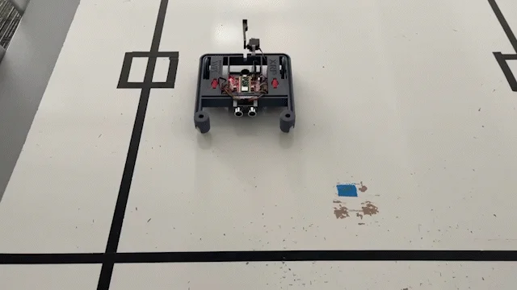

Sensing Lines
=============

Introduction
------------

The XRP has two **reflectance** sensors mounted under the front bumper. Each
reflectance sensor shines an infrared light at the ground and measures the intensity of the 
light reflected from the driving surface. The darker an object is, the less light it reflects.
The sensor uses infrared light, just like a TV remote, so the light is not 
visible to the human eye.

.. figure:: images/line_sensors.png
    :width: 450

    The reflectance sensor as it is mounted on the underside of the robot front bumper.

This sensor is perfect for sensing dark lines on a light background! If the 
sensor is on top of a dark line, less light will be reflected back, and if it is
not on a line, more light will be reflected back. The left and right sensor objects
return values that are between 0.0 and 1.0 depending on the intensity of the reflected light.

**XRPLib** provides functions to read the values of the reflectance sensors:

.. code-block:: python

    from XRPLib.defaults import *

    # Reads the left sensor and stores the value in the variable "left"
    left = reflectance.get_left()

    # Reads the right sensor and stores the value in the variable "right"
    right = reflectance.get_right()

Characterizing the sensors
--------------------------
Before using a new sensor in an application, it's important to understand
the values it will return in different conditions. For the reflectance 
sensor, determine the values the sensor reports when it is:

* completely off the line (seeing a white surface),
* completely on the line (seeing a black surface),
* and straddling the line.

.. tip:: 

    Test a single sensor at a time, either the left or right.
    Make sure that the correct part of the sensor board is over
    the line when taking measurements.

.. admonition:: Try it out

    To test the sensor over the surface that will be used, write a program to print the value
    of the chosen reflectance sensor and then, 
    print out the values in an infinite loop as the robot is moved around on the white surface
    with a line, and record the values the sensor reads.

What do you notice from the values measured? The documentation for the 
``reflectance`` module in **XRPLib** states that the ``get_left()`` and 
``get_right()`` functions return a number between 0 and 1. Did the values ever 
reach exactly 0 or exactly 1? Which range of values corresponds to
seeing white and which values correspond to seeing black?

Given the values determined in the previous step, what would be a good 
"threshold" value, such that if the sensor reports a 
value greater than the threshold, we can confidently assume the sensor is seeing
a line, and if the sensor reports a value below the threshold, we can assume it 
is not seeing a line.

Introduction to Conditionals
----------------------------

In Python, conditionals allow you to execute certain pieces of code based on whether a condition is true or false. The most common conditional statement is the `if` statement.

Here is an example:

.. code-block:: python

    threshold = 0.5  # Example threshold value
    sensor_value = reflectance.get_left()

    if sensor_value > threshold:
        print("Sensor is over the line")
    else:
        print("Sensor is not over the line")

In this example, if the `sensor_value` is greater than the `threshold`, the program will print "Sensor is over the line". Otherwise, it will print "Sensor is not over the line".

Stopping at a Line
------------------

Using the knowledge of conditionals, write a program to drive the robot forward until both sensors detect the line.

.. admonition:: Try it out

    Write a program to drive the robot forward until both sensors detect the line. Use a conditional statement to check the sensor values.

    Here is an example of how you might write this code:

    .. code-block:: python

        from XRPLib.defaults import *

        threshold = 0.5  # Example threshold value

        # Set the speed of both wheels
        drivetrain.set_speed(5, 5)

        # Initialize sensor states
        left_over_line = False
        right_over_line = False

        # Drive forward until both sensors detect the line
        while not (left_over_line and right_over_line):
        
            # Check the left sensor
            if reflectance.get_left() > threshold:
                left_over_line = True
            else:
                left_over_line = False

            # Check the right sensor
            if reflectance.get_right() > threshold:
                right_over_line = True
            else:
                right_over_line = False

        # Stop the drivetrain
        drivetrain.stop()

.. note::

    You could also write this in a more concise way: 

    .. code-block:: python

        from XRPLib.defaults import *

        threshold = 0.5  # Example threshold value

        # Set the speed of both wheels
        drivetrain.set_speed(5, 5)

        # Drive forward until both sensors detect the line
        while not (reflectance.get_left() > threshold and reflectance.get_right() > threshold):
            pass
        
        # Stop the drivetrain
        drivetrain.stop()

    Test your code by placing the robot on a surface with a line and observing if it stops when both sensors are over the line. If the robot does not stop correctly, adjust your threshold value or check your conditional statement. 

    The XRP driving forward until both sensors detect the line.
