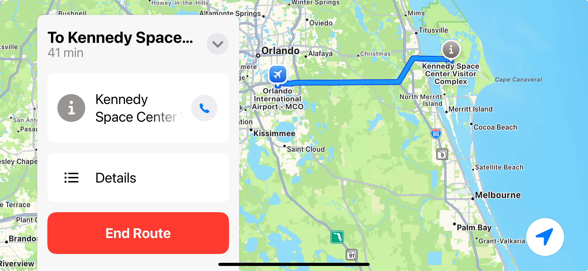

Street navigation
=================

GPS Navigation
--------------

People use mapping programs based on Global Positioning System (GPS) satellites every day to help them
drive from one place to another. They have been built into cars and are now available on portable
devices like cell phones and handheld navigators. They attempt to present the most optimal route
to get from one place to another.

But what is the most optimal route? Think about some of the things that might make one route better
than another.

* Shortest distance to maximize fuel used
* Least travel time to get somewhere in a hurry
* Minimizing the elevation gains for hikers
* Minimizing the highway tolls that have to be paid
* Including stops for recharging an electric car

What are some of the things that might go into the calculation of the most optimal route?

* Road conogestion on a particular part of the route
* Road construction that might slow down travel
* Highway roads that might be longer vs more direct but slower city streets
* Accidents on a road that slow traffic that might even occur once the trip begins

Your final project
------------------
The final project that you will do is to find the shortest path between intersections
on a grid of squares. This is a simplified version of the problem just discussed, but
it has many of the same characteristics of the real case. To make it more realistic,
some of the intersections in the grid will be blocked, representing accidents or
road construction that your robot will have to avoid. 

The algorithm that we will use is very similar to what commercial GPS navigators use
to help us drive from one place to another. We will discuss it in more detail when we
get near the end of the course.