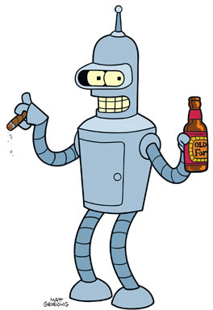

Introduction to Programming
---------------------------

"My story is a lot like yours, only more interesting ‘cause it involves robots."

Syllabus
========
The XRP programming class is an introduction to computer science for high school and early
college age students. Using robots in a computer science makes learning exciting and much more
engaging. In this class you will write a program that solves an interesting problem, planning
a path to get from one place to another. Your project will work the same way that cars use
to find the shortest path to navigate from one place to another.

Course flow
-----------
Throughout the course you will program your robot to navigate on a grid from one intersection to another taking the shortest path possible while avoiding obstacles along the way. This algorithm, called Dijkstra's Algorithm, is similar to those used by GPS mapping software such as Google Maps to find the shortest driving route between two points.
Each week of the course there will be project that you are responsible for completing. Each of those projects will hopefully be built upon to create the final project. 
The idea is that in solving this problem, you will learn basic to intermediate Python programming to serve as a base for more advanced CS and RBE classes later.

You will:

* implement 7 projects, about one per week

* We will try to do something with the robots most days, so bring them every day to the classroom.

* You should have fresh batteries, a laptop, and a USB cable. The robot works better with fully charged batteries (this isn't meant to be a snarky comment, some of the sensors don't work very well on lower voltage). 

* Projects will build on each other, so each weeks work should be similar to the previous week - no getting crushed on a two week marathon final project. But it is important to not get behind or you'll have a hard time catching up.

What you'll learn:

* Programming paradigms using the Python language running on your own personal computers and on the XRP robot.

* Some very basic Object Oriented program design concepts that will apply to other languages such as Java and C++.

* Some robotics concepts such as robot control and the use of sensors for  following lines and measuring distances.

* Top down design for breaking down complex problems into more manageable simpler tasks.

* Testing and debugging techniques to make it easier for program development.

